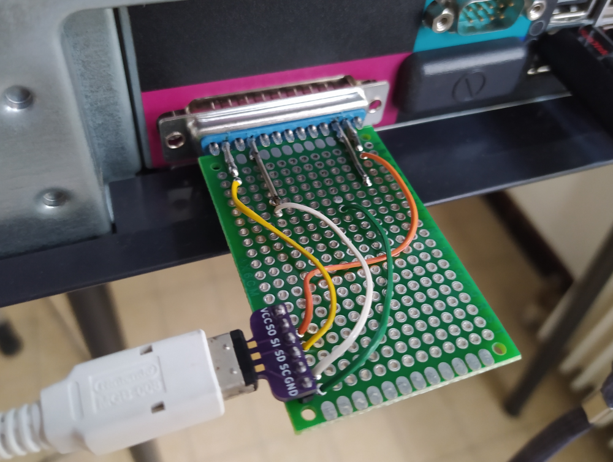
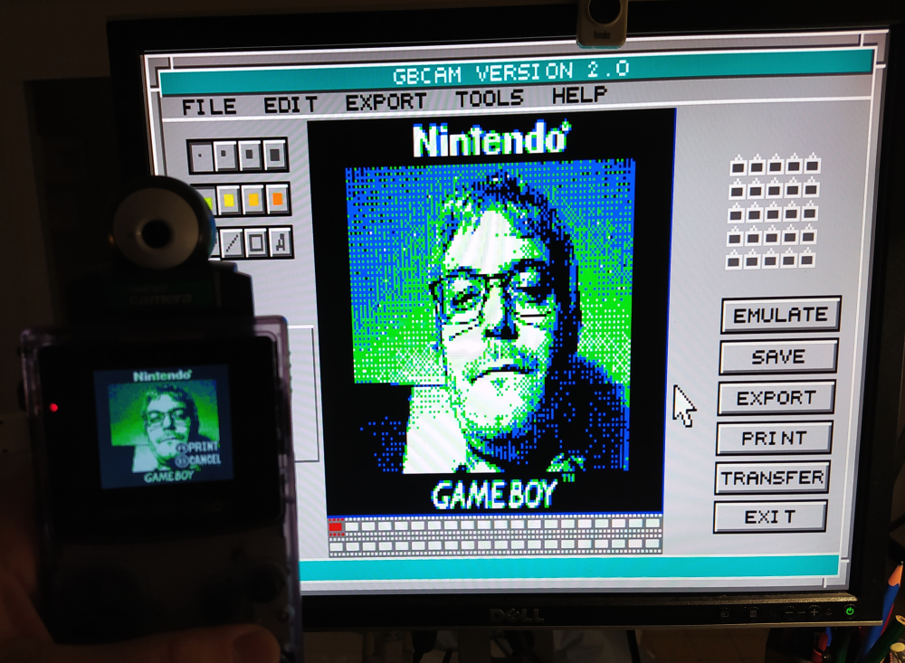

## A Game Boy Printer emulator from 1998 !

This repo is a sanctuary for a series of codes written by Martin Eyre in 1998. They are intended to be used on Windows 98/Me/DOS to emulate a Game Boy Printer through the parallel port. I used these codes around 2005 to extract my first images from a Game Boy Camera (even several dozens of them in fact), before using a parallel GB transferer imported from HK around 2007, then a GBxCart from 2018 to now. 

**The codes require a physical LPT parallel port and a real DOS environment to work** (Windows 2000 not compatible either so). It is moreover not possible to use it with any emulated OS (like DOSbox) or any USB parallel port emulator (I've tried every possible "easy" way before giving up and coming back to the real old hardware/software required).

The codes are given "as it", typically as I downloaded them in 2005. I remind struggling to understand the interest of the schematic necessary from the project as it made no sense to me. I finally used a more simple setup without any active component, which I unfortunately lost in a house move around 2008, but which was working. In december 2023, I've tried to make it work again, because I had lot of fun using it in 2005.

To what I understand, the code uses the D0 bit to bitbang the Game Boy and uses "Out of paper" printer interrupt to receive data from Game Boy. Clock is routed to the ACK interrupt. I must admit that using a LPT port as it is quite clever. I'm also impressed that the code was written very early at a time where informations about the printer protocol were probably quite hard to find !

The codes comes with an GNU Octave decoder to convert the raw data output by the code (in fact just image data in [Game Boy Tile format](https://www.huderlem.com/demos/gameboy2bpp.html)) in PNG images. The decoder can convert data in bulk from the code directory, just drop the .m files in the emulator directories and run them with GNU Octave on a modern computer.

## Updated schematic to connect the Game Boy to the PC

As far as I can tell, the schematic indicated in the original code is strange to say the least as SOUT is just allowed to send short pulses instead of steps. It may be inspired from one [published by Jeff Frowhein](https://www.devrs.com/gb/files/hardware.html) for another purpose (communication with GBbasic). I've tried it with all the [component indicated](https://www.devrs.com/gb/files/gb2pp7.gif) (the transistor 2N3906 and the diode 1N914), it does not work at all with the two computers I own running Win 98/Me. I may be unlucky. But removing all that crap and it works ! So here is the working schematic updated: make it simple.

Side note: if you decide to cut a serial cable, do not trust the wire color, always use a multimeter as SIN and SOUT are crossed somewhere in the cable.

## Hardware I used to connect the Game Boy to the PC in 2024

Here is my janky implementation of the schematic (I'm not particularly proud of it but I've made several tests, I needed room on the board). It requires a serial breakout board if you do not want to sacrify a serial cable.

Finding a Windows 98 compatible PC for free in 2024 was not that easy but after digging in some lab dumpsters I finally found one and here is the result: it works ! When I say "it works" I mean it does not always work, but enough to be usable. Both versions of the code suffer some protocol instability and crashes but are usable to get images from a Game Boy Camera with a bit of patience. I guess the protocol instability are due to the finicky timing required. I've tried to add 100 nF caps on the lines but it did not improves the stability.

## Using the code in 2024: still working !

Finally the codes come with a way of sending data to the printer but with another schematic that I did not try yet. I'm not sure the feature was implemented. Moreover, I do not expect the code to support anything but the camera.
