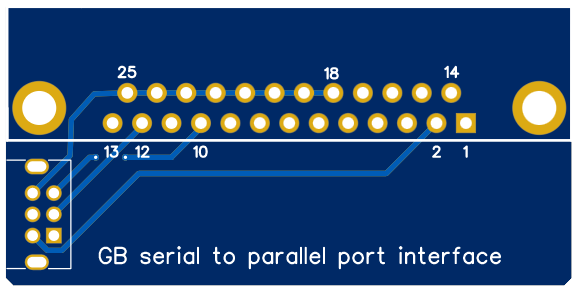

## A Game Boy Printer emulator from 1998 !

This repo is a sanctuary for a series of codes written by Martin Eyre in 1998. They are intended to be used on Windows 98/Me/DOS to emulate a Game Boy Printer through the parallel port. I used these codes around 2005 to extract my first images from a Game Boy Camera (even several dozens of them in fact), before using a parallel GB transferer imported from HK around 2007, then mainly an [Arduino based](https://github.com/mofosyne/arduino-gameboy-printer-emulator) or an [ESP32 based](https://github.com/zenaro147/NeoGB-Printer) Game Boy Printer emulator). I also sometimes used a GBxCart but it's another story.

As far as I can tell, the codes were lost on the internet (the 1.3 [just reappeared](https://www.gamebrew.org/wiki/Gameboy_Printer_Emulator_GB) some time ago, but not the 2.0), so the sanctuary. Version 2.0 was apparently never completely finished (but works better than the 1.3 which crashes constantly).

**The codes require a physical LPT parallel port and a real DOS environment to work** (Windows 2000 not compatible either so). It is moreover not possible to use it with any emulated OS (like DOSbox) or any USB parallel port emulator (I've tried every possible "easy" way before giving up and coming back to the real old hardware/software required).

The codes are given "as it", typically as I downloaded them in 2005 and as I stored them carelessly for 19 years, copying them from hard drives to hard drives. I remind struggling to understand the interest of the schematic necessary from the project as it made no sense to me. I finally used a more simple setup without any active component, which I unfortunately lost in a house move around 2008 (as well as my first Game Boy), but which was working for sure. In december 2023, I've tried to make it work again, because I had lot of fun using it in 2005.

To what I understand, the code uses the D0 bit to bitbang the Game Boy and uses "Out of paper" printer interrupt to receive data from it. Clock is routed to the ACK interrupt. I must admit that using a LPT port as it is quite clever. I'm also impressed that the code was written very early at a time where informations about the printer protocol were probably quite hard to find !

The codes comes with an modern GNU Octave decoder to convert the raw data output by the code (in fact just image data in [Game Boy Tile format](https://www.huderlem.com/demos/gameboy2bpp.html)) in PNG images. The decoder can convert data in bulk from the code directory, just drop the .m files in the emulator directories and run them with GNU Octave on a modern computer.

## Updated schematic to connect the Game Boy to the PC

The schematic indicated in the original code is strange to me as SOUT is just allowed to send short pulses instead of steps. It may be inspired from one [published by Jeff Frowhein](https://www.devrs.com/gb/files/hardware.html) for another purpose (communication with GBbasic). I've tried it with all the [component indicated](https://www.devrs.com/gb/files/gb2pp7.gif) (the transistor 2N3906 and the diode 1N914), it does not work at all with the two computers I own running Win 98/Me. I may be unlucky or missed a LPT configuration detail. But I removed all that crap and it worked ! So the working schematic is: make it simple.

Side note: if you decide to cut a serial cable, do not trust the wire color, always use a multimeter as SIN and SOUT are crossed somewhere in the cable.

## Hardware that I used to connect the Game Boy to the PC in 2024

Here is my janky implementation of the schematic (I'm not particularly proud of it but as I've made several tests, I needed room on the board). It requires a serial breakout board if you do not want to sacrify a serial cable, or a dedicated PCB (see next).

Finding a Windows 98 compatible PC for free in 2023 was in fact the most difficult part of the project but after digging in some lab dumpsters I finally found one and here is the result: it works ! When I say "it works" I mean it does not always work, but enough to be usable (runs better in pure DOS mode). Both versions of the code suffer some protocol instability and oftenly crashes but are usable to get images from a Game Boy Camera with a bit of patience. I guess the protocol instabilities are due to the finicky timing required. I've tried to add 100 nF caps on the lines but it did not improves the stability.

## Want something clean to play with the code ?

You can order a [dedicated PCB matching the schematic](/PCB). Just buy a [90° male DB25 parallel port](https://fr.aliexpress.com/item/1005006186899118.html) and a [GBC/GBA serial socket](https://fr.aliexpress.com/item/1005006358075502.html). Using a PCB avoids struggling with SIN/SOUT inversions.

## Using the code in 2024: still working !

Finally the codes come with a way of sending data to the printer but with another schematic that I did try without success. I've of course tried to invert SIN and SOUT and different sofware options before giving up. I'm not sure the feature was fully implemented as it makes the code crashing each time I used it and my printer sees nothing legit arriving to its port. Moreover, I do not expect the code to support anything but the camera, but who knows.

## Acknowledgements

- Thanks to [Martin Eyre](https://web.archive.org/web/20000915214526/http://skyscraper.fortunecity.com/macro/730/) for this code allowing me to save GB Camera images around 2005. I would be glad to know the story of this project.
