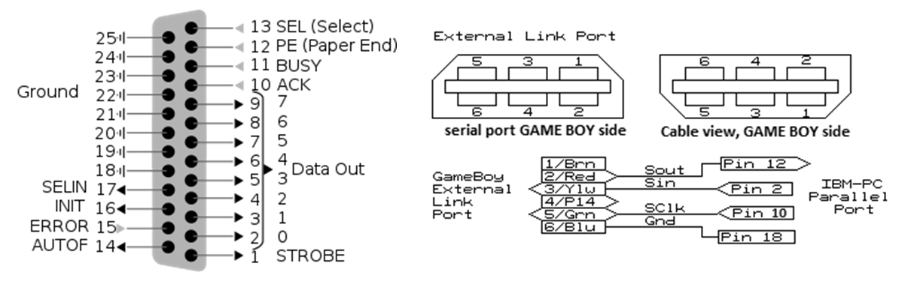

## A Game Boy Printer emulator in 1998 !

This repo aims to be a sanctuary for a series of codes written by Martin Eyre in 1998. They are intended to be used on Windows 98/Me or DOS to emulate a Game Boy Printer. I used these codes around 2005 to extract my first images from a Game Boy Camera (even several dozens of them), before using a parallel GB transferer imported from HK around 2007, then a GBxCart from 2018 to now. The codes requires a **mandatory physical LPT parallel port**. It is not possible to use it with any emulated OS or any parallel port emulator (I've tried every possible way before giving up and coming back to the real old hardware setup required).

The codes are given "as it", typically as I downloaded them in 2005. I remind struggling to understand the schematic from the project in 2005 as it made no sense for me at that time (and using a more simple wiring PCB lost in a moving around 2008, but which was working). In 2024, I can definitively tell that it makes no sense for the purpose of supporting the printer protocol only.

To what I understand, the code uses the D0 bit to bitbang the Game Boy and uses "Out of paper" printer interrupt to receive data from Game Boy. Clock is routed to the ACK interrupt. I must admit that using a LPT port as it is quite clever. 

## Schematic to connect the Game Boy to the PC

As far as I can tell, the schematic given in the original code is sketchy to say the least. It may be inspired from one [published by Jeff Frowhein](https://www.devrs.com/gb/files/hardware.html) for another purpose. I've tried it with all the component required (the transistor 2N3906 and the diode 1N914), it does not work at all. But removing all that crap and it works ! So here is the working schematic updated.

## Hardware to connect the Game Boy to the PC

Here is my janky implementation of the schematic (no I'm not proud of it). It requires a serial breakout board if you do not want to sacrify a serial cable.

Finding a Windows 98 compatible PC for free in 2024 was not that easy but after exploring some lab dumpsters I finally found one and here is the result: it works ! When I say "it works" I mean it sometimes works, but enough to be usable. Both versions of the code suffer the same protocol instability and crashes but are usable to extract images.

## Using the code in 2024: still working !

